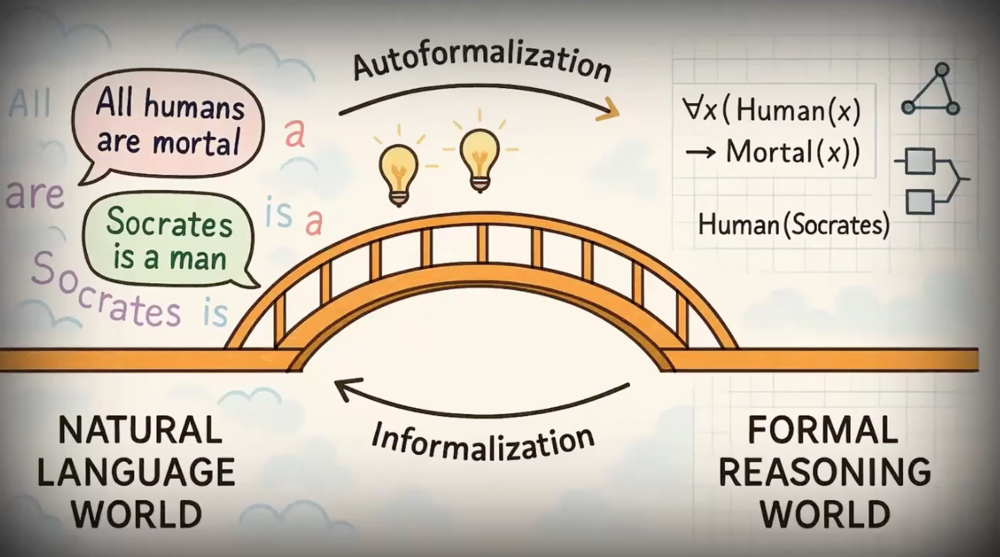

# Towards General Autoformalization Workshop (Thursday 26th of November)

Welcome to Towards General Autoformalization, our first multi-disciplinary autoformalization workshop at [Royal Holloway, University of London](https://www.royalholloway.ac.uk).

Large language models routinely translate natural language into formal languages that machines can check and reason with: proofs in Lean or Isabelle, logical formulas, Prolog programs, PDDL plans, ontologies, and more. We call this task "autoformalization", and we think that understanding it well is central to building AI that we can trust. So far we see that researchers in mathematics, verification, planning, and knowledge representation often tackle the same autoformalization problems separately and under different names. In this workshop, we aim to bring together researchers in these communities from across the UK, to share benchmarks, methods, and ideas, and to help shape a common foundation for autoformalization and (through it) reliable and verifiable AI.

Watch our talk at AAAI: 

## Venue

The Workshop will take place from 9am to 4pm in:
**Stewart House, Room 2
32 Russell Square,
London WC1B 5DN**

<iframe src="https://maps.google.com/maps?q=Stewart+House,+32+Russell+Square,+London+WC1B+5DN&output=embed" width="100%" height="400" style="border:0;" allowfullscreen loading="lazy"></iframe>
   
### Getting There
Stewart House, Royal Holloway's London campus, is in the heart of Bloomsbury, London. Public transport is the easiest way to reach us.

**By Underground**
 - **Russell Square** (Piccadilly line): about 5 minutes' walk
- **Holborn** (Central and Piccadilly lines): about 8 minutes' walk
- **Goodge Street** (Northern line): about 10 minutes' walk
- **Tottenham Court Road** (Central, Northern and Elizabeth lines): about 10 minutes' walk

**By train**
**King's Cross St Pancras** and **Euston**: about 15–20 minutes on foot, or take the Piccadilly line one stop from King's Cross to Russell Square.

## Program 

### Arrival & Welcome: 8:45am to 9am

### Keynote Talk: 9am to 10am

*TBA*

### Coffee Break: 10am to 10:30pm       

### Presentation Session 1: 10:30am to 12pm

*Chair: TBD*

This session will include 3-5 presentations by workshop participants

### Lunch: 12pm to 1:30pm

### Presentation Session 2: 1:30pm to 3pm

*Chair: TBD*

This session will include 3-5 presentations by workshop participants

### Coffee Break: 3pm to 3:30pm       

### Panel: 3:30pm to 4:30pm

### Closing Remarks: 4:30pm to 4:45pm

## Organisation

 - Dr [Agnieszka Mensfelt](https://pure.royalholloway.ac.uk/en/persons/agnieszka-mensfelt/), Lecturer in Computer Science, Royal Holloway
 - Dr [David Tena Cucala](https://pure.royalholloway.ac.uk/en/persons/david-tena-cucala/), Lecturer in Computer Science, Royal Holloway
 - Dr [Santiago Franco Aixela](https://pure.royalholloway.ac.uk/en/persons/santiago-franco/), Lecturer in Computer Science, Royal Holloway
 - Dr [Angeliki Koutsoukou-Argyraki](https://pure.royalholloway.ac.uk/en/persons/angeliki-koutsoukou-argyraki/), Lecturer in Computer Science, Royal Holloway
 - Prof [Kostas Stathis](https://pure.royalholloway.ac.uk/en/persons/kostas-stathis/) Professor in Computer Science, Royal Holloway

